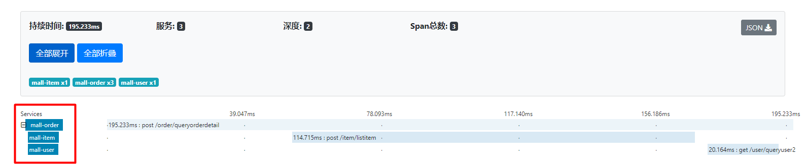
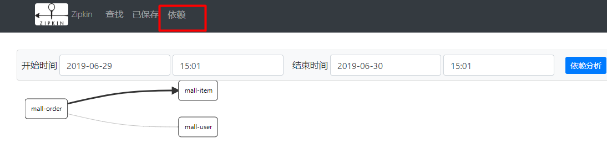
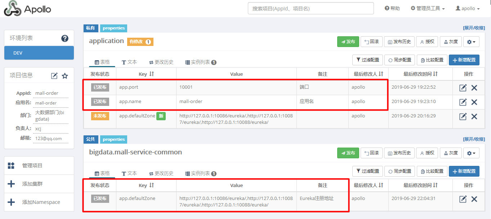
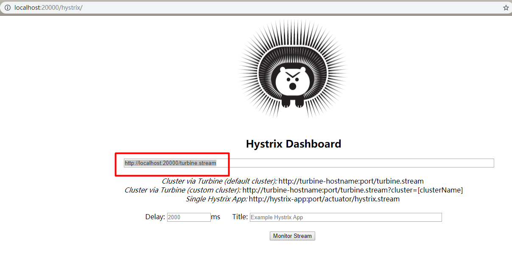

# springcloud学习

## springcloud组件：
本工程运用的组件：
- Eureka：作为注册中心（多个Eureka运行，搭建高可用注册中心）
- Zuul：作为所有微服务的网关（设置网关过滤所有请求，并转发请求到对应的服务系统）
- Feign和Ribbon：来调用其他系统的服务（Feign是在Ribbon的基础上进行的封装，能够传输实体类）
- Hystrix：提供服务熔断，防止服务雪崩
- turbine：监控Hystrix服务性能
- Apollo： 代替嫡系的springcloud config完成分布式配置集中管理
- zipkin+sleuth：链路跟踪，显示一个服务调用经历的时间、服务之间的依赖关系

## 模块介绍：
- hystrix-turbine： Hystrix服务性能监控
- mall-base-module：所有模块的基础模块，包含一些共用的类和通用依赖
- mall-eureka-node：注册中心服务
- mall-gateway-zuul：网关服务（设置敏感词过滤器）
- mall-item：商品服务
- mall-order：订单服务
- mall-sso：单点登录服务 
- mall-user：用户服务
- zipkin-server： 链路跟踪服务（不建议使用，版本兼容性，推荐使用zipkin官网打包好的jar）

## 项目介绍：
- 整个系统几乎使用到常用的springcloud组件，而且搭建整个系统时踩到很多坑。尤其是springcloud与springboot之间的版本问题。所以本项目具有一定的版本局限。
- 在订单服务中，调用了用户和商品服务（采用Feign来实现，同时Ribbon来进行负载均衡）
- Zuul配置了过滤器，所有请求都需要经过网关，然后统一对所有请求进行过滤。
- Eureka以集群的方式进行搭建（三个），实现HA的服务注册中心。
- Apollo作为配置中心，不仅单独给每个某块创建私有配置，也有一些共用的配置（例如：数据库的连接信息、注册中心）
- zipkin用于将服务的调用过程显示，sleuth用于跟踪采集服务调用过程的一些信息（例如：每个服务调用时长，响应情况等等）

## 测试效果：
### zipkin链路跟踪方法的调用过程

### 显示服务之间依赖关系

### Apollo配置中心
一定要搭建好Apollo服务器（下载压缩包、在数据库导入创建对应数据库等等。。。。）
说明：应用配置相应id，然后应用就会根据Apollo的地址拉取对应的配置信息并缓存到本地（默认是：c盘的opt目录中的data目录自定义）

### turbine监控
这个组件还是那句话，版本兼容性差。知道它是用来监控Hystrix服务的性能状况就行了，基本上只是作为一个监控工具。并不需要利用它来进行开发工作。
